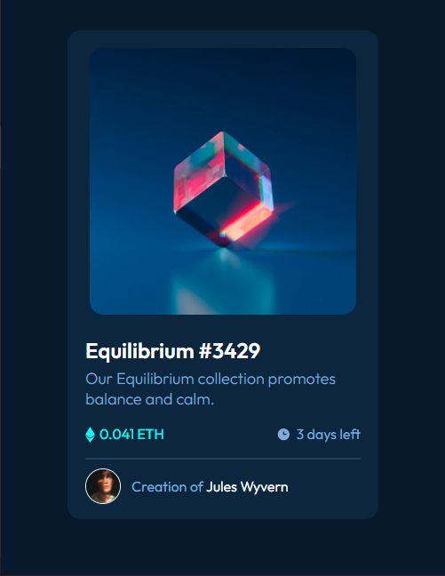

# Frontend Mentor - NFT preview card component solution

This is a solution to the [NFT preview card component challenge on Frontend Mentor](https://www.frontendmentor.io/challenges/nft-preview-card-component-SbdUL_w0U). Frontend Mentor challenges help you improve your coding skills by building realistic projects.

- [Overview](#overview)
  - [The challenge](#the-challenge)
  - [Screenshot](#screenshot)
  - [Built with](#built-with)
  - [Author](#author)

## Overview

A challenge to make NFT card layout using HTML + CSS

### The challenge

Users should be able to:

- View the optimal layout depending on their device's screen size
- See hover states for interactive elements

### Screenshot

### Built with

- Semantic HTML5 markup
- CSS
- Flexbox
- CSS Grid
- Mobile-first workflow

## Author

- Frontend Mentor - [@qalkaraimeh](https://www.frontendmentor.io/profile/qalkaraimeh)
- LinkedIn - [Qutaibah Alkaraimeh](https://www.linkedin.com/in/qutaibah-alkaraimeh-58aba0199)
- CodePen - [qalkaraimeh](https://codepen.io/qalkaraimeh/pens/public)
